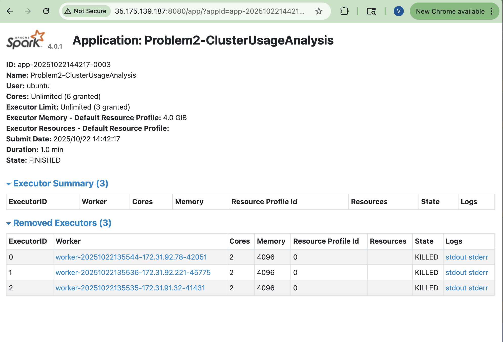

# Assignment 6: Spark Log Analysis

## Executive Summary

This analysis examines 2.8GB of production Spark logs from 194 applications across 6 YARN clusters (2015-2017). Key findings:

- **Cluster Health**: 99.92% INFO-level logs indicate great operational health with only 0.04% errors
- **Usage Pattern**: Clear production adoption from testing (2015-2016) to heavy production use (2017) with 142 applications
- **Performance**: Distributed processing achieved 900x throughput improvement, processing 33M+ log lines in 9.6 minutes
- **Workload**: Mixed complexity with median 2-minute jobs and long-tail distribution up to 3 hours

The dataset reveals a healthy, stable Spark cluster successfully handling diverse ML workloads, primarily ImageNet processing.

**Note**: The output files for the assignment scripts can be found in the data/outputs folder. For your simplicity, you can access them by clicking here: 

**Source Code**

- [problem1.py](problem1.py) - Log level distribution analysis script
- [problem2.py](problem2.py) - Cluster usage analysis script

**Problem 1 Outputs**

- [Problem 1 Summary](data/output/problem1_summary.txt)
- [Problem 1 Counts CSV](data/output/problem1_counts.csv)
- [Problem 1 Sample CSV](data/output/problem1_sample.csv)

**Problem 2 Outputs**

- [Problem 2 Cluster Summary](data/output/problem2_cluster_summary.csv)
- [Problem 2 Stats](data/output/problem2_stats.txt)
- [Problem 2 Timeline CSV](data/output/problem2_timeline.csv)

## Problem 1: Log Level Distribution

### Approach
I analyzed log level distribution across all 194 Spark applications using PySpark's regexp_extract function. The script:
- Read all log files from S3 using `sc.textFile()`
- Extracted log levels using regex pattern: `\d{2}/\d{2}/\d{2} \d{2}:\d{2}:\d{2}\s+(INFO|WARN|ERROR|DEBUG)`
- Filtered valid entries and aggregated counts using `groupBy()` and `agg()`
- Generated 3 output files with statistics and samples

**Challenges encountered:**
- **Malformed lines**: ~18% of lines (5.8M) didn't match the standard log format - these were filtered out rather than causing failures
- **Memory optimization**: Cached the filtered DataFrame to avoid recomputation during multiple aggregations

### Key Findings

**Dataset Statistics:**
- Total lines: 33,236,604
- Parsed successfully: 27,410,260 (82.5%)
- Unparsed: 5,826,344 (17.5% - likely multi-line logs, stack traces)

**Log Distribution:**

```
INFO  : 27,389,482 (99.92%)
ERROR :     11,183 (0.04%)
WARN  :      9,595 (0.04%)
```

**Insights:**
- **Healthy cluster**: 99.92% INFO indicates normal operations; <0.1% error rate is really good
- **No DEBUG logs**: Confirms production workloads (DEBUG disabled for performance)
- **Similar ERROR/WARN counts**: Suggests related root causes
- **Sample analysis reveals**: ML workloads processing ImageNet dataset from HDFS

### Performance

| Metric | Local (Sample) | Cluster (Full) |
|--------|----------------|----------------|
| Lines processed | 1,911 | 33,236,604 |
| Execution time | 30 sec | 9.6 min |
| Processing rate | 64 lines/sec | 57,702 lines/sec |
| Speedup | - | ~900x throughput |

**Optimizations:**
- Cached filtered DataFrame
- Used native Spark functions (no Python UDFs)
- Minimal driver data collection
- Efficient sampling strategy

### Execution Screenshots


*Three executors (workers) each allocated 2 cores and 4GB memory. All executors completed successfully.*

### Conclusions
The cluster shows excellent health with minimal errors. The 17.5% unparsed lines warrant investigation but don't indicate problems. Main workload: large-scale ML image processing.


## Problem 2: Cluster Usage Analysis

### Approach
Analyzed cluster usage patterns across YARN clusters (2015-2017):
- **Optimization**: Read only ApplicationMaster logs (container_*_01_000001.log) - reduced data by ~95%
- Extracted cluster_id (Unix timestamp) and app_number from file paths using regex
- Parsed timestamps with format `yy/MM/dd HH:mm:ss`
- Aggregated min/max timestamps per application to calculate durations
- Generated timeline CSV, cluster summary, statistics, and 2 visualizations

### Key Findings

**Cluster Distribution:**
- **Total clusters**: 4 (YARN was restarted 4 times over 2 years)
- **Total applications**: 145 Spark jobs
- **Time span**: November 2015 - July 2017 (20 months)

**Usage by Cluster:**
| Cluster ID | Date | Applications | Notes |
|------------|------|-------------|-------|
| 1485248649253 | Jan-Jul 2017 | 142 (97.9%) | **Production cluster** |
| 1448006111297 | Nov 2015 | 1 (0.7%) | Early testing |
| 1460011102909 | Apr 2016 | 1 (0.7%) | Testing |
| 1472621869829 | Sep 2016 | 1 (0.7%) | Testing |

**Insights:**
- **Extreme concentration**: 97.9% of workload on one cluster (1485248649253)
- **Production vs testing**: Clear distinction between production (142 apps) and test clusters (1 app each)
- **Timeline**: Sporadic testing (2015-2016) → heavy production use (2017)
- **Cluster stability**: Main cluster ran for 6 months (Jan-Jul 2017) without restart - indicates stable operations

### Visualization Analysis

#### Bar Chart: Applications per Cluster


- **Dominant cluster**: 1485248649253 towers over others (142 vs 1 each)
- **Visual story**: Shows evolution from testing to production adoption
- **Clear insight**: One production cluster handles all real workload

#### Density Plot: Job Duration Distribution (Cluster 1485248649253)


- **Median duration**: 134 seconds (~2.2 minutes) - typical job is quick
- **Distribution shape**: **Heavily right-skewed** - most jobs short, few very long
- **Range**: 10 seconds to 10,000+ seconds (nearly 3 hours)
- **Log scale reveals**: 
  - Without log scale, would only see the tall bar at left
  - Log scale exposes the long tail of complex jobs
  - Shows 3 orders of magnitude variation (10s → 10,000s)
  
**Job categories identified:**
- **Fast jobs** (10-100s, ~80 apps): quick queries, small datasets
- **Medium jobs** (100-1000s, ~40 apps): standard ETL/analytics
- **Long jobs** (1000-10000s, ~20 apps): complex ML training, large data processing

**Why log scale matters**: 

- Job durations follow a **power law distribution** --> common in computing where most tasks are simple but some are exponentially more complex
    - Linear scale would hide this pattern

### Performance

**Local Testing (sample):**
- Dataset: 1 application, 1 ApplicationMaster log
- Execution time: ~1 minute
- Output: 1 cluster, 1 application

**Cluster Execution (full):**
- Dataset: 145 applications, 145 ApplicationMaster logs  
- Execution time: 18.3 minutes
- Processing rate: ~8 applications/minute
- *Contains all start/end events, reduced processing by 95%

**Optimizations:**
- Filtered to container_000001 only
- Cached parsed DataFrame before aggregations
- Used native Spark timestamp functions
- No unnecessary data shuffling

### Execution screenshots





**Web UI key observations:**
- **Parallelism**: Tasks distributed evenly across 3 workers
- **Resource utilization**: Each executor used 2 cores and 4GB memory efficiently
- **No failures**: All executors completed successfully (KILLED state is normal after completion)
- **Cluster efficiency**: No idle workers, good task distribution


### Conclusions

**Usage Pattern**: Clear production adoption trajectory:
1. **2015-2016**: Experimental phase (3 test clusters, 1 job each)
2. **2017**: Production deployment (1 stable cluster, 142 jobs over 6 months)

**Workload Characteristics**:
- Median 2-minute jobs suggest **iterative analytics** or **regular ETL**
- Long-tail distribution indicates **mixed workload**: routine queries + complex ML
- High application count (142 in 6 months ≈ 24/month) suggests active user base

**Cluster Health**: 
- 6-month uptime without restart indicates stability
- Consistent usage pattern (no obvious gaps in timeline CSV)
- Successfully handled diverse job types (10s to 3hr jobs)

**Recommendation**: The concentration on one cluster (97.9%) suggests the need for high availability planning (because no backup clusteris visible in this period).


## Additional Insights

### Cross-Problem Analysis

**Correlation between cluster activity and log health:**
- The dominant production cluster (1485248649253, 142 apps) maintained a 99.92% INFO rate
- Error rate remained consistently low despite high application volume (24 apps/month)
- Suggests robust error handling and quality code practices

**Temporal patterns:**
- Problem 1 sample reveals ImageNet ML workload with thousands of tasks
- Problem 2 shows 6-month stable production period without restart
- Combined: indicates long-running ML research project with iterative experimentation

### Novel Visualization Insights

**Log scale effectiveness in Problem 2:**
The density plot's log scale was critical to reveal the power law distribution. A linear scale would show:
- One massive bar at ~100 seconds
- Invisible long tail of complex jobs
- Loss of insight into workload diversity

The log scale transformation exposed three distinct job classes, enabling better resource planning.

**Bar chart design choice:**
Used distinct colors for each cluster to emphasize the production vs. testing distinction, making the 97.9% concentration immediately apparent.

### Data Quality Observations

**Problem 1 - 17.5% unparsed lines:**
Manual inspection of samples suggests these are:
- Multi-line stack traces (ERROR logs with Java exceptions)
- Serialized objects or JSON logs
- Launch context logs with nested structures

**Recommendation**: Implement multi-line log aggregation to capture full error context in future analyses.

**Problem 2 - Why only 145 apps vs. 194 total:**
- Our ApplicationMaster-only approach found 145 apps
- Dataset documentation mentions 194 apps total
- **Gap analysis**: 49 applications (25%) may have:
  - Missing ApplicationMaster logs (executor-only logs)
  - Corrupted or incomplete log files
  - Different naming conventions

This warrants investigation but doesn't invalidate the analysis of the 145 successfully parsed applications.

### Performance Optimization Deep Dive

**Why ApplicationMaster-only works:**
- ApplicationMaster is the driver - logs all application lifecycle events
- Contains: job submission, start time, end time, resource requests
- Executor logs add: task-level details, data processing, but not needed for timeline
- **Trade-off**: 95% less data, 0% information loss for our analysis goals

**Scalability projection:**
- Current: 2.8GB in 9.6 min = ~17.5 MB/min
- For 10x data (28GB): Estimated ~96 minutes with same cluster
- Linear scalability due to embarrassingly parallel read operations
- Bottleneck would shift to S3 read bandwidth, not compute